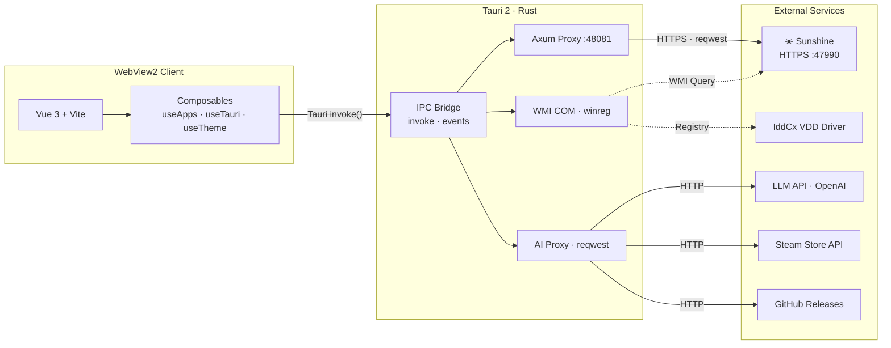

# Sunshine Control Panel (Tauri)

Sunshine Control Panel is a big-screen desktop manager for Sunshine based on Tauri 2 + Vue 3, providing game library management, system monitoring, AI assistant, and other features.

## Architecture



## Features

### Core Capabilities

- 🔄 **Update Management** — Auto-check updates, download progress tracking, and one-click installation. Supports switching to Beta/pre-release versions.
- ⚡ **Execution Mode Switcher** — One-click toggle between Service Mode ↔ User Mode.
- 🔌 **Service Management** — Start/stop/restart Sunshine, monitor running status, and manage paired devices.
- 📊 **Memory Monitoring** — Real-time memory/working set trend charts, child process list, and runtime duration statistics.

### Game Library

- 🎮 **App Management** — Grid/list views, search filtering, pinning/favorites, recent items, and sorting.
- 🖼️ **Steam Cover Art Search** — Right-click to update cover art, search Steam Store API candidates, and upload with one click.
- 🚀 **One-Click Launch** — Right-click to start games/apps, with support for administrator privileges and working directories.
- 🔧 **Launch Helper** — Configure pre- and post-launch scripts (e.g., virtual monitor setup, resolution switching).
- 📚 **Library Scan** — Automatically scan and import installed Steam/Epic games.

### Streaming & Drivers

- 🎬 **Streaming Configuration** — Encoder selection (H.264/H.265/AV1), bitrate adjustment, and automatic HDR switching.
- 📺 **VDD Driver Management** — Install/configure Virtual Display Driver and manage EDID.
- 🖱️ **Virtual Mouse** — Driver installation and status management.
- 🌙 **Moonlight Web** — In-browser streaming service management.

### AI & Tools

- 🤖 **Mita AI** — Integrates Large Language Models (LLM) into Sunshine and the client. Features multi-model config and a desktop pet.
- 🛠️ **Toolbox** — Bitrate calculator, DPI scaling, hotkey reference, and system diagnostics.
- 📋 **Log Management** — Real-time log viewing, exporting, and filtering.

### Desktop Experience

- 🎨 **Theme Customization** — Light/Dark modes and custom backgrounds.
- 🌍 **Bilingual Support** — Instant Chinese/English toggle.
- 🪟 **Multi-Window** — Main window + Floating toolbar + Log console.
- ☀️ **Anti-Sleep** — Keeps screen/system awake during streaming sessions.
- 🔑 **Global Shortcuts** — Toggle toolbar with `Ctrl+Shift+Alt+T`.

## Prerequisites

- Node.js and npm
- Rust and Cargo (for Tauri)
- Windows SDK (Windows)

## Development

```bash
# Install dependencies
npm install

# Start the dev server (proxies to Sunshine service)
npm run dev

# Start the frontend dev server only
npm run dev:renderer
```

### WebUI Linked Development Mode

If you need to develop the WebUI and Tauri GUI concurrently, you can use the `dev-webui` mode to proxy requests from Tauri's proxy server to the WebUI dev server:

```bash
# Terminal 1: In the Sunshine project root, start the WebUI dev server (port 3000)
cd ../../../..  # Go back to the Sunshine root directory
npm run dev-server

# Terminal 2: In the sunshine-control-panel directory, start Tauri (proxied to WebUI dev server)
npm run dev-webui
```

In this mode:
- The WebUI dev server runs at `https://localhost:3000`
- The Tauri proxy server forwards requests to the WebUI dev server
- Hot Module Replacement (HMR) is supported (edits to WebUI code apply in real-time)
- API requests are still proxied by the WebUI dev server to the Sunshine service (`https://localhost:47990`)

## Build

```bash
# Build frontend renderer
npm run build:renderer

# Build complete application
npm run build

# Build for Windows
npm run build:win
```

## Project Structure

```
src-tauri/           # Tauri Backend (Rust)
  ├── src/
  │   ├── main.rs            # Main entry & command registrations
  │   ├── proxy_server.rs    # Axum local proxy (Sunshine/Steam API/CORS)
  │   ├── sunshine.rs        # Sunshine process management & path utilities
  │   ├── system.rs          # System info (WMI process queries, memory stats)
  │   ├── fs_utils.rs        # Filesystem, game scanning, Steam cover search/upload
  │   ├── commands.rs        # HTTP client & app launching
  │   ├── vdd.rs             # VDD driver management
  │   └── windows.rs         # Windows registry / autostart
  ├── inject-script.js       # Script injected into Sunshine Web UI
  └── Cargo.toml

src/renderer/        # Frontend (Vue 3)
  ├── desktop/              # Desktop UI (Independent SPA)
  │   ├── views/            # Views (Dashboard, Apps, Settings...)
  │   ├── components/       # Components (AppGrid, ContextMenu, CoverPicker...)
  │   ├── composables/      # Composables (useApps, useTauri...)
  │   └── i18n/             # Translations (zh, en)
  ├── components/           # Shared components
  └── styles/               # Less styles

vite.config.js       # Vite configuration
package.json         # NPM package manifest
```

## Tech Stack

- **Frontend**: Vue 3 + Less + Custom Components
- **Backend**: Rust + Tauri 2
- **HTTP**: Axum (local proxy), reqwest (HTTP client)
- **System**: WMI (process query), Win32 API (memory metrics), Windows Registry
- **Build Tool**: Vite

## Integration with Sunshine

The built GUI is automatically installed to Sunshine's `assets/gui` directory:

```
Sunshine/
  └── assets/
      └── gui/
          └── sunshine-gui.exe
```

## Important Notes

- The Tauri GUI is an optional component and does not affect the core functionality of Sunshine.
- A Rust toolchain is required to build the Tauri application.
- The initial build will download and compile Rust dependencies, which may take some time.
